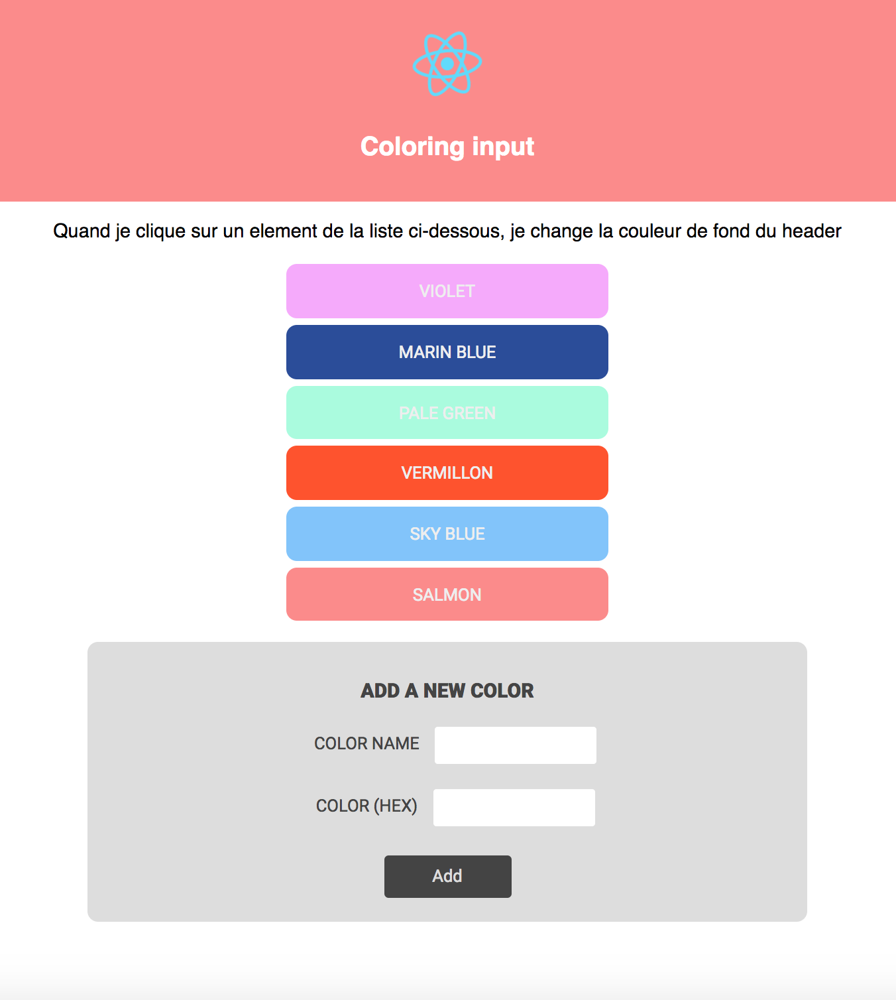

# SDW3-projet-eval1
Projet d'evaluation à mi-parcours

## Attendus :

* Faire un fork d'un projet existant
* Faire une pull request avec github 
* creation d'une app react à partir d'un boilerplate (create-react-app)
* mise en place d'un linter pour react, es6, babel
* Mise en place d'un app stylisé (css) à partir d'un brief fonctionnel
* Gestion du state et des style d'une app react

## Consignes :

1. faire un fork du projet
2. faire un premier commit
3. créer la pull request avec votre nom et votre prénom dans le message de la pull request
4. produire l'exercice sur votre fork
5. Une fois que vous considérez l'exercice terminé, vous ajoutez un commentaire dans la pull request : 'TERMINÉ'
6. L'EXERCICE DOIT ÊTRE RENDU AVANT LE MARDI 04 AVRIL À 15H00
7. Bonne chance

## Brief :

Vous devez produire une application web qui permet de changer la couleur du header en cliquant sur les elements d'une liste.

Chaque élément de la liste comprent un nom et une couleur.

L'application permettra aussi d'ajouter des elements à la liste via un formulaire comportant 2 inputs :

* un pour le nom de la couleur
* un pour la couleur. (vous pourrez améliorer l'input color en utilisant un color picker)

Le format de donnée des couleurs pourrait être le suivant :

```
{
  "colors": [
    {"id":0, "name": "rouge", "color": "#FF0000"},
    {"id":1, "name": "violet", "color": "violet"},
    {"id":2, "name": "orange", "color": "orange"},
    {"id":3, "name": "noir", "color": "black"}
  ]
}
```

L'application finale pourrait ressembler à l'image suivante :



1rst commit Kieran
